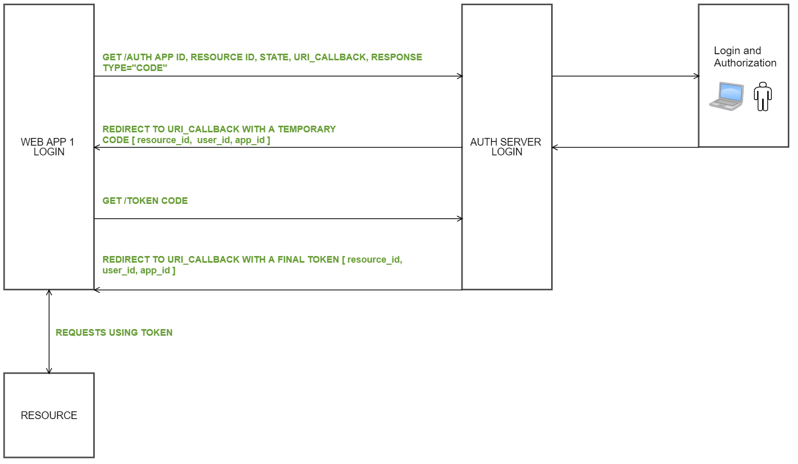

## SSO - OAuth2

Single Sign On using oAuth2 & JWT
The project constist of 3 apps:

This application has a users database and a login form to validate them. It implements oAuth2 server service auth:


###  Code Flow




**Ask for permissions using "code"**

```
http://127.0.0.1:8000/users/authorize/
?response_type=code
&client_id=765
&resource_id=432
&redirect_uri=http://127.0.0.1:8000/app1/auth_landing_page
&state=asdf1234
&scope=all
```

Independent applications uses the Authorization Server to validate its users.
Once the user has validated with username and password, it will be redirected to:

```
http://127.0.0.1:8000/app1/auth_landing_page
?code=xxxxxxxxxxxxxxxxxxxxxxxxxxxxxxx
&state=asdf1234

```

Get final token:

```
/token
?client_id=765
?client_secret=xyz
?code=xxxxxxxxxxxxxxxxxxxxxxxxxxxxxxx
```

Response
```
HTTP/1.1 200 OK
Content-Type: application/json
{
   "access_token" : "asdasdfasdadfadf...",
   "token_type" : "Bearer",
   "expires_in" : 3600,
   "scope" : "all"
}
```


 **Ask for permissions using "token"**

```
http://127.0.0.1:8000/users/authorize/
?response_type=token
&client_id=765
&resource_id=432
&redirect_uri=http://127.0.0.1:8000/app1/auth_landing_page
&state=asdf1234
&scope=all
```

Redirect URI:

```
http://127.0.0.1:8000/app1/auth_landing_page
?access_token=xxxxxxxxxxxxxxxxxxxxxxxxxxxxxxx
&expire_in=3600
&state=asdf1234

```